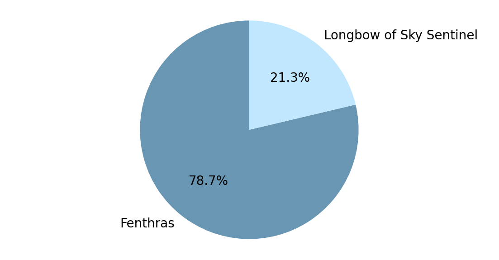

### Testing which longbow from Critical Role is better, Fenthras or Longbow of Sky Sentinel.
`fenthras_vs_lss.ipynb` &mdash; the main file with both code and explanation. 

`dndrv.py` — I define a class for a discrete random variable that allows addition, subtraction, and multiplication with other discrete random variables. Uses NumPy, SciPy, matplotlib.

`fen_lss.csv` &mdash; a CSV with results in the format "setting parameters -> winner". Columns: Rounds, Target AC, STR save, Winner.

The answer is clear:
---

